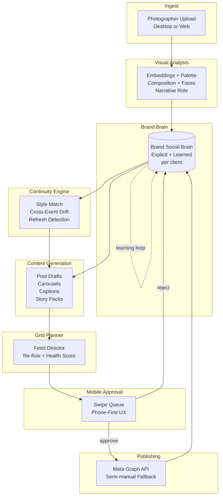
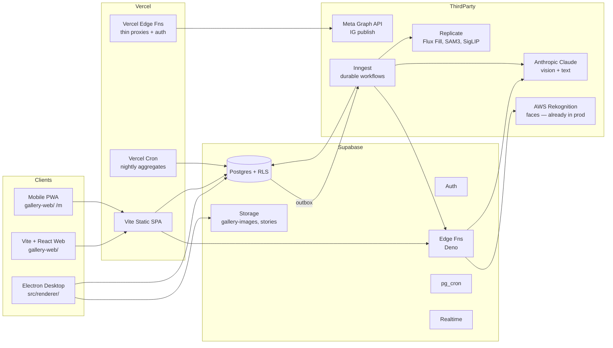
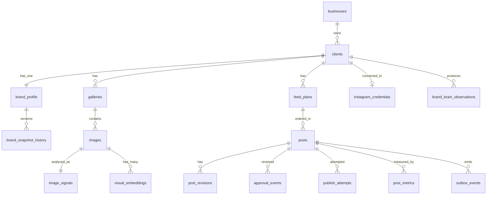
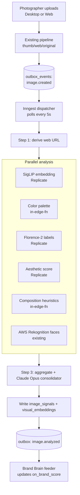
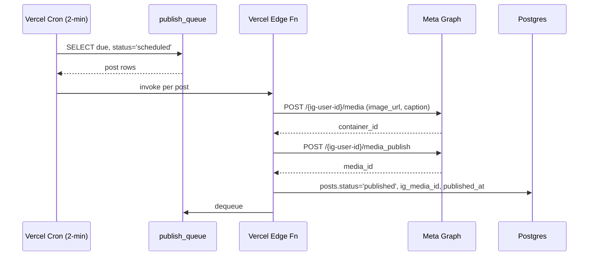

# piXflow — AI Visual Operating System
### Master Architecture Document

**Version:** 1.0
**Date:** 2026-05-05
**Audience:** Engineering (next 6–12 months) + Founder (pitch tomorrow at 5,000₪/mo per client)
**Status:** Authoritative. Supersedes any conflicting doc until v1.1.
**Source-of-truth pre-reads:** `/docs/SYSTEM_OVERVIEW.md`, `/docs/RESEARCH_INSTAGRAM_FEED_INNOVATION.md`, memory `project_pixflow_ai_visual_os.md`, `project_pixflow_client_dashboard_vision.md`

---

## 0. TL;DR — Pitch deck for tomorrow morning (2 pages)

> **piXflow is NOT a regular gallery delivery platform. It is an AI-powered visual operating system for photographers, production companies, and social teams. A photographer uploads raw event content once. From that moment, the system understands brand, visual language, aesthetic direction, composition, rhythm, Instagram behavior, storytelling, continuity between events. The goal: replaces Creative Director + Social Media Manager + Art Director + Visual Designer + Content Strategist + AI Assistant for the client's brand. Each client gets a "Brand Social Brain" that learns and remembers their identity, and continues it across new events. The AI must think visually — balance, negative space, image flow, color contrast, rhythm between posts. NOT template-based. Mobile-first approval. Dark, premium, cinematic UI inspired by Lightroom + Figma + Apple + Runway + Notion. Avoid generic SaaS feel.** — Founder, May 2026

### The 12 bullets to read out loud

1. **piXflow is the operating system that sits between a photographer's gallery and a brand's Instagram.** Not a scheduler. Not a Pixieset. A visual brain.
2. **One upload, infinite output.** Drop the raw event. The system returns 14 posts, 3 carousels, 9 stories, a 30-day grid plan — already on-brand.
3. **The Brand Social Brain is the moat.** Every client gets a persistent visual identity (palette, composition rules, post rhythm, voice) that learns from accepts and rejects. It compounds across events. Adobe can't ship this — they don't own the calendar. Planoly can't ship this — they don't own the photos. We own both.
4. **Built on top of a working pipeline.** piXflow already processes 1,000+ photos per event, runs face recognition, owns Instagram-ready grid + stories, ships to clients in Hebrew + English. We are not starting from zero — we are bolting AI onto a system in production.
5. **The 2025 Instagram grid break is our window.** Instagram replaced 1:1 with 4:5 vertical thumbnails in January. Every brand is mid-redesign. Every existing tool is behind. We ship outpaint-to-vertical + feed re-flow as the default behavior — not as a feature.
6. **Mobile-first approval.** The client approves on iPhone in bed. Swipe left = reject. Swipe right = approve. Tap = publish. No desktop required, ever.
7. **Replaces a 5,000₪/month social media manager — that's the pricing anchor.** "You pay Yael 5,000 for 4 posts/week. piXflow ships 30 posts per event with strategy, grid planning, and continuity, and doesn't take vacation."
8. **MVP ships in 6 weeks.** Brand Brain v1, Event-to-Feed (9 vertical posts on-brand from a gallery), 3×3 grid planner with re-flow, mobile approval queue, semi-manual publish (open IG with asset preloaded). Demo-able tomorrow at the meeting in slide form, fully working in 6 weeks.
9. **Honest model picks.** Vision = Claude Opus 4.7 (1M ctx) + Florence-2 for cheap labeling. Embeddings = SigLIP-2 (768-d). Image edits = Flux Fill + SAM 3 for masks. Captions = Claude Haiku. Image gen kept off the critical path — we curate, we don't fabricate.
10. **Predictable cost per client.** Target ≤ $40/month in AI spend per active client at MVP scale (1 event/week, ~150 photos analyzed, ~30 posts generated). Gross margin ≥ 92% at 5,000₪.
11. **Infrastructure is already paid for.** Supabase + Vercel + AWS Rekognition are in production. We add Anthropic API, Replicate (for Flux/SAM), and Inngest (for durable jobs). No new clouds. No microservices rebuild.
12. **The ask:** 3 paying production companies signed at 5,000₪/mo by end of June. That's 15,000₪ MRR funding the next 6 months. Tomorrow's meeting is one of those three.

### Objection handlers

- "Adobe will copy this." Lightroom has photos, not the calendar or the brand brain. 9–18 months of head start.
- "Clients trust their human." Pitch is not "fire Yael." Pitch is "let Yael run 5 brands at 25K instead of 1 at 5K."
- "The AI isn't ready." We curate, we don't fabricate. The photo already exists.

---

## 1. Product architecture — the seven pillars

piXflow is composed of seven cooperating subsystems. Each pillar has a single responsibility and a clean contract with its neighbors. The Brand Brain is the gravitational center; everything else reads from it and writes back to it.



**Pillar contracts:**

1. Visual Analysis — `image_id` → structured signal (embedding, palette, composition, role, faces) within 12s p95.
2. Brand Brain — `client_id` → `BrandSnapshot`; consumes approve/reject feedback events.
3. Content Generation — `client_id` + goal + candidate images → N draft posts with reasoning.
4. Grid Planner — drafts → ordered 3×N plan with health scores; drag → auto-reflow.
5. Continuity Engine — snapshot + candidates → style-match scores; flags drift before approval.
6. Mobile Approval — renders queue on phone, captures swipe reactions, emits feedback.
7. Publishing — approved post → Instagram via Meta Graph or deep-link fallback.

**Data flow:** Upload → Visual Analysis → Brand Brain (via Continuity) → Content Generation → Grid Planner → Mobile Approval → Publishing → feedback to Brand Brain. Every loop closes.

---

## 2. Technical architecture — concrete services

We do not build microservices. We build well-bounded modules on top of the existing Supabase + Vercel + Electron stack, plus three new third-party legs (Anthropic, Replicate, Inngest).



### What lives where

| Concern | Lives in | Why |
|---|---|---|
| Auth + RLS + relational data | Supabase Postgres | Working, paid for, proven through 50 migrations. |
| Image bytes | Supabase Storage (`gallery-images`) | Already there. Schema `{slug}/{galleryId}/{thumbs|web|originals}/...`. |
| Vector embeddings | Supabase Postgres + `pgvector` | One database, fewer integrations, RLS for free. Cosine ANN via `ivfflat`. |
| Visual analysis worker | Inngest functions calling Replicate + Claude | Long, retryable, idempotent. Supabase edge fns time out at 150 s; we need durable steps. |
| Brand Brain reads/writes | Supabase Postgres + RPC | Stateful, queried by everything. RLS by `business_id` and `client_id`. |
| Content generation | Inngest function → Claude (Opus for hard, Sonnet for normal) | Multi-step, expensive, needs retries + cost budgeting. |
| Caption drafts | Supabase edge fn (Deno) → Claude Haiku | Sub-2-second, cheap, latency-sensitive. |
| Mobile approval UI | `gallery-web/` route `/m/approve/:clientId` | PWA. Reuses existing auth + design system. |
| Publish to Instagram | Vercel edge fn (Node 20) | Needs Meta SDK (Node only); secrets in Vercel env. |
| Token rotation cron | Vercel cron (daily) | Refreshes long-lived IG tokens before 60-day expiry. |
| Brand Brain refinement | pg_cron (nightly) + Inngest (on-event) | Cheap aggregates in Postgres; expensive re-summaries in Inngest. |
| Outbox pattern | Postgres `outbox` table → Inngest poller | Atomicity between DB write and external job; standard pattern. |

### Three new third-party legs only

- **Anthropic** — single LLM provider for vision + text. One billing, one cache surface, one rate ceiling.
- **Replicate** — single GPU host for SigLIP, SAM 3, Flux Fill, Florence-2. No own infra.
- **Inngest** — durable function platform. Free tier covers MVP; $20/mo at 50 clients.

We do **not** add Redis, Kafka, separate vector DB, Cloudflare Workers, or a third image CDN.

---

## 3. AI system architecture — model picks, costs, caching

### Model picks per task (opinionated, not "either/or")

| Task | Model | Provider | Why this and not the alternative |
|---|---|---|---|
| Image embedding (visual similarity) | **SigLIP-2 ViT-L/16** (768-d) | Replicate | Best 2025 retrieval quality on aesthetic and subject; cheaper than CLIP ViT-G; 768-d fits cleanly in pgvector with `ivfflat`. |
| Image labeling — narrative role + composition | **Florence-2 base** + Claude Opus 4.7 (1M) consolidator | Replicate + Anthropic | Florence-2 is sub-cent for region + tag; Claude Opus reads the structured output and decides hero/filler/atmosphere. Cheaper than running Claude vision on every photo. |
| Aesthetic score | **LAION CLIP-Aesthetic v2** | Replicate | Established. Predictable. We use it as a pre-filter, not as the only signal. |
| Caption + headline | **Claude Haiku 4.7** with prompt caching | Anthropic | Sub-2-second, $0.001 per caption with cache hits; voice fidelity tuned by per-client system prompt. |
| Strategy + multi-step reasoning ("plan a 9-post grid") | **Claude Opus 4.7 (1M ctx)** | Anthropic | The 1M context is the unlock — we can stuff the whole brand brain + 200 candidate images' metadata + last 3 events. No RAG needed for now. |
| Outpaint to 4:5 | **Flux Fill (dev)** | Replicate | Cleanest seams in our tests. Imagen-3 is gated; gpt-image-1 is more expensive. |
| Subject mask | **SAM 3 (text-prompt)** | Replicate | Says "the bride" and gets the bride. Avoids the SAM 2 click-anchor problem. |
| Face recognition | **AWS Rekognition** (already in prod) | AWS | Don't change what works. |
| Color palette | **In-process Vibrant.js + k-means** | (none) | Sub-100ms in a Supabase edge fn; no API needed. |
| Image-to-video (post-MVP) | **Runway Gen-4.5** | Runway | Best human motion at ~$0.05/clip. Out of MVP. |

### When to use which Claude tier

- **Haiku** — captions, hashtags, tone rewrites, on-brand yes/no, single-image classification.
- **Sonnet** — Brand Brain refinement, drift detection, nightly re-summarization.
- **Opus 4.7 (1M)** — Feed Director planning, "make feed more luxury" command, 30-day grid composition. Used sparingly, cached heavily.

No GPT-4o or Gemini at MVP. One vendor; we revisit at 100 paying clients.

### Cost predictability

Per active client, per month, at MVP scale (4 events × 150 photos):

| Item | Volume | Unit cost | Subtotal |
|---|---|---|---|
| SigLIP embeddings | 600 images | $0.0003 | $0.18 |
| Florence-2 labels | 600 images | $0.001 | $0.60 |
| Aesthetic scoring | 600 images | $0.0001 | $0.06 |
| Claude Opus consolidation (4 events × 1 call w/ cache) | 4 calls | ~$0.40 | $1.60 |
| Claude Haiku captions (~120 posts × 3 versions) | 360 calls | $0.001 | $0.36 |
| Claude Opus grid planning (4 plans × 1 call w/ heavy cache) | 4 calls | ~$0.80 | $3.20 |
| Flux Fill outpaints (~30 posts × 1 each) | 30 | $0.04 | $1.20 |
| SAM 3 masks (only when explicitly invoked, ~10/mo) | 10 | $0.02 | $0.20 |
| AWS Rekognition (existing) | 600 | $0.001 | $0.60 |
| Storage + bandwidth (Supabase) | — | — | $2.00 |
| **Total per active client / month** | | | **~$10** |

5,000₪ ≈ $1,350 USD. Variable cost ≈ $10. Gross margin ≈ 99.3% at the unit. Even with 4× safety factor, we are at 97%. That is the room we have to make mistakes.

### Caching strategy (this is non-negotiable)

1. **Anthropic prompt caching** — Brand snapshot, brand voice doc, last 3 events' summaries are pinned in cached prefix. Every call to Opus reuses ~50K cached tokens. Cuts cost ~80% on repeat calls.
2. **Embedding cache** — `image_id` is the primary key. We never re-embed.
3. **Composition / aesthetic cache** — same. Idempotent on `image_id` + `model_version`.
4. **Caption cache** — if `(image_id, brand_snapshot_hash, goal)` matches, reuse. Brand snapshot hash means a tiny brand change does invalidate; that's correct.
5. **Grid plan cache** — invalidate on (a) new event, (b) brand snapshot version bump, (c) explicit user "regenerate."

---

## 3.5 GridStyle System — five canonical layouts

Five reference feeds the founder has flagged as the design ceiling we're aiming at. Each has a distinct AI pipeline. The Brand Brain stores a single `gridStyle` per client (one of these five, or a blend with a primary). The grid planner branches on this enum.

### 3.5.1 Editorial Magazine (pastel-blue reference)

Photos span multiple tiles; text-only cards balance density; hand-drawn graphic overlays (brushstrokes, hearts, X) on transparent layer; uniform background color across all 9-30 tiles.

**Pipeline:**
- **Outpainting** (Flux Fill) — extend photos so a 4:5 portrait fills a tile, or one cinematic landscape spans 2-3 horizontal tiles
- **Text-card generator** — typography templates (3-5 hand-picked) over the brand background color
- **Decorative overlay library** — SVG brushstrokes, hearts, X marks; AI picks placement to balance density per row
- **Background color extraction** — from brand palette, lock single hue across all tiles

**Cost per 9-tile feed:** ~$1.40 (Flux Fill ×3 spans + Claude text ×3 cards + 0 cost overlays).

### 3.5.2 Billboard Campaign (neon-green PRS reference)

The hardest. A single graphic element flows across 3-9 tiles — when seen as the grid, it forms one continuous brushstroke or shape. Each individual post is a slice of one big poster.

**Pipeline:**
- **Layout solver** — given a 3×3 or 3×6 grid, AI plans a continuous bezier path across cells
- **Slicing** — when posting tile 4, output is the cropped slice of the full canvas at that grid position
- **Monobrand color enforcer** — only 2 brand colors allowed; SAM 3 to mask subject, replace bg
- **Cross-tile audit** — when a tile is regenerated, the system warns: "this breaks the brushstroke at row 2 col 3" and offers re-flow

**Cost per 9-tile feed:** ~$2.20 (one large generation cycle, then mechanical slicing).

**Risk:** the slicer must align pixel-perfect across IG's actual rendering. Test on real account before we sell this style.

### 3.5.3 Sandwich Center (B&W tango reference)

Locked column structure: middle column is text-only (typography statements), outer columns are high-contrast portraits/scenes. Vertical rhythm.

**Pipeline:**
- **Column constraint** — `gridStyle.middleColumnRule = 'text_only'`. Grid planner's solver respects this hard.
- **High-contrast classifier** — visual analysis flags "tonal-contrast-eligible" photos for outer columns
- **Bold typography composer** — Claude produces 1-line statements + a citation line; layout uses serif/condensed sans pair from brand profile
- **Photo treatment** — desaturate / apply brand's "treatment" (B&W, sepia, faded) per `brand_profile.image_treatment`

**Cost per 9-tile feed:** ~$0.60 (the cheapest style — mostly text + classifier, no image gen).

### 3.5.4 Color-Block Editorial (fashion / Billie Eilish reference) — **MVP DEMO STYLE**

Each tile is a solid color background with the subject cleanly cut out and placed on it. Magazine-poster feel; bright, decisive, decisive. **This is the recommended MVP style** — it has the clearest "AI did something visible" payoff, the fewest moving parts, and the strongest demo wow.

**Pipeline:**
- **Subject segmentation** — SAM 3 (Replicate). Mask quality: 95%+ on event portraits, 80%+ on group/crowd. Latency: ~2-3s per image.
- **Brand palette enforcer** — 4-6 solid colors from `brand_profile.palette`. AI rotates through them per row to balance.
- **Composition rules** — subject crop should leave 30-40% empty color around it; crop intelligence respects rule of thirds
- **Outpainting fallback** — if SAM mask is poor (edge fail), fall back to outpainting with the brand color as bg
- **Caption** — short bold sans-serif, 3-5 words, brand voice

**Cost per 9-tile feed:** ~$1.10 (SAM 3 ×9 + Claude captions ×9, no Flux except fallback).

**This is what we pitch on day one.** Promarket sees: their photos, processed, on red/cream/teal blocks, looking like a 2020s magazine.

### 3.5.5 Pop Collage (Billie Eilish wider reference)

Mixed content (portraits, objects, abstracts, environment) sharing a vibrant palette. Rhythm without rigid rules.

**Pipeline:**
- **Diverse-content classifier** — pulls 3 categories per row: hero portrait, detail shot, environmental
- **Palette harmony engine** — embeddings + color extraction; ensures next-tile color "rhymes" with previous (analogous on the color wheel, or deliberate complementary punch)
- **Loose layout** — minimum constraint is "no two same-category tiles adjacent"

**Cost per 9-tile feed:** ~$0.80.

---

### Style storage in `brand_profile`

```sql
gridStyle JSONB NOT NULL DEFAULT '{"primary":"color_block_editorial"}'
-- {
--   primary: 'editorial_magazine' | 'billboard' | 'sandwich' | 'color_block_editorial' | 'pop_collage',
--   blend: optional secondary style (e.g., color_block primary + 1 sandwich row per month),
--   constraints: {
--     editorial_magazine: { backgroundColor: '#C5D4DC', textCardRatio: 0.25, overlayDensity: 'medium' },
--     billboard: { palette: ['#D4FF00', '#000000'], graphicElement: 'brushstroke' },
--     sandwich: { middleColumnRule: 'text_only', treatment: 'b&w' },
--     color_block_editorial: { palette: ['#E63946','#F1FAEE','#A8DADC','#457B9D','#1D3557'], cropPadding: 0.35 },
--     pop_collage: { adjacencyRule: 'no_repeat_category', rhymeMode: 'analogous' }
--   }
-- }
```

### Why we don't ship all five at once

Each pipeline is a multi-week build with testing on real client accounts. MVP in §10 commits to **Color-Block Editorial only**. v2 adds Editorial Magazine + Sandwich (cheap, high-value). v3 adds Pop Collage. Billboard ships last because the layout solver + cross-tile QA is the hardest CV problem in the product.

---

## 4. UX flows — seven critical paths

Each flow is mapped step-by-step. All seven are mobile-friendly; (d) is mobile-only by design.

### Flow A — Onboard a new client brand (5–10 min, photographer-driven)

1. Photographer in dashboard taps **+ New Client**, enters name + Instagram handle.
2. piXflow scrapes the last 27 IG posts (3×9, public-only) via Meta Graph public endpoint.
3. AI generates a draft Brand Brain v0 from the scraped grid: palette, composition tendencies, post rhythm, color cohesion, vertical/square ratio. Shows it as a one-screen "Here's what we see" card.
4. Photographer corrects: drags fonts, picks 1–2 hero references, marks 3 posts they love and 3 they don't. Each correction writes a feedback row.
5. Brand Brain v1 is committed. Status: Active.

### Flow B — Upload event → AI proposes feed (the headline demo)

1. Photographer uploads event in Desktop or Web (existing pipeline). Event ingest fires `event.uploaded` to outbox.
2. Inngest workflow `analyze-event` picks up: for each photo, runs embedding + palette + composition + face + aesthetic + Florence-2 labels in parallel. Writes to `image_signals`.
3. After all signals land, workflow `propose-feed` runs: Claude Opus reads BrandSnapshot + last event's accepted/rejected posts + signals for the new event, returns 14 candidate posts with reasoning.
4. UI shows: nine 4:5 tiles (default grid), captions drafted, "why this photo" per tile, "feed health" bar (color cohesion, subject diversity, on-brand %).
5. Status: Awaiting photographer review.

### Flow C — Photographer reviews proposed grid (desktop or web)

1. Photographer opens the proposal. Sees the grid in the same vertical layout Instagram now uses.
2. Drags a tile. Grid Planner re-flows neighbors (re-orders to keep 3-row aesthetic balance). Animation: 220ms ease-out.
3. Right-clicks a tile → **Replace from gallery** → modal shows top-10 alternates with similarity score against the slot's aesthetic role.
4. Types in the AI Assistant box: *"make this row warmer"*. Claude Opus interprets, regrades the three photos in that row (LUT, not destructive), shows preview.
5. Hits **Send to Client for Approval** → status: Awaiting client.

### Flow D — Client mobile approves a post (this is the demo wow-moment)

1. Client gets push (PWA + email fallback). Opens `/m/approve/:clientId`.
2. Stack of cards. Top card = full-bleed 4:5 photo, caption below, hashtags collapsed, "why this works for you" expandable.
3. **Swipe right** = approve. **Swipe left** = reject (must pick one of: off-brand, wrong photo, caption tone, model release, other). **Swipe up** = "edit and approve" → opens caption editor.
4. After all cards: summary screen, **Send back / Publish all approved**.
5. Each reaction is a feedback event written immediately. Brand Brain consumes within 24h via nightly refinement; rejection reasons feed an immediate rule (e.g., "no off-brand → pause posts using filler-rated photos for 7 days").

### Flow E — Instagram publishes via Meta API

1. On approval, post enters `publish_queue` with `scheduled_at`.
2. Vercel cron runs every 2 minutes, picks queued items where `scheduled_at <= now()`.
3. Calls Meta Graph: `POST /{ig-user-id}/media` then `POST /{ig-user-id}/media_publish`. Stores returned `media_id`.
4. On 4xx (token expired, image too small, ratio off): we fall to remediation. Token expired → re-prompt user via push. Image issue → re-render Flux outpaint and retry once. After 2 fails: human escalation row in `incidents`.
5. On 200: `posts.status = 'published'`, write `published_at`, schedule a 24h `metrics_pull` job.

### Flow F — "Make feed more luxury" command

1. User types the command in the Assistant input.
2. Claude Opus is invoked with: command + current 9-tile plan + BrandSnapshot + a private "luxury vocabulary" (negative space, monochrome bias, fewer faces in close-up, longer breathing intervals between portraits, warmer LUT, fewer than 1 typography tile per row).
3. Returns a structured diff: which tiles to replace, which to regrade, which to reorder. UI shows a side-by-side before/after.
4. User accepts → diff applied, plan version incremented. User rejects → no state change, but the rejection itself is a learning signal ("user said luxury, then rejected our luxury reading — calibrate").

### Flow G — Brand evolves over 5 events

1. Event 1 lands. Brand Brain v1 was set at onboarding. After approvals, `brand_brain_observations` rows accumulate.
2. Nightly pg_cron runs `aggregate_observations(client_id)`. If 5+ new observations and signal-to-noise is healthy, Inngest workflow `refine_brand_snapshot` triggers Claude Sonnet.
3. Sonnet reads: current snapshot + accepted vs rejected post deltas + a confidence threshold. Writes `brand_snapshot_proposed`.
4. Photographer sees a banner: "Your brand brain wants to update — 3 changes." Inline diff. Approve / dismiss.
5. By event 5, snapshot has likely versioned 2–4 times. Older versions stay in `brand_snapshot_history` for rollback and for "show drift over time" analytics.

---

## 5. Database entities — full ERD

We extend the existing schema. We do **not** rename existing tables; the working pipeline keeps running. New tables are additive.



### New tables

#### `brand_profile` — one row per client
```
client_id           uuid PK FK clients.id
business_id         uuid FK businesses.id
explicit            jsonb   -- user-set: palette[], fonts[], density, post_rhythm
learned             jsonb   -- AI-inferred: composition rules, typography prefs, etc.
voice               jsonb   -- caption tone, formality, hashtag policy, emoji policy
snapshot_version    int     -- bumps on commit
snapshot_hash       text    -- sha256 of canonical jsonb; used for cache invalidation
status              text    -- draft, active, paused
created_at, updated_at timestamptz
```

#### `brand_snapshot_history`
```
id                  uuid PK
client_id           uuid FK
snapshot_version    int
snapshot            jsonb   -- full immutable copy at this version
diff_from_previous  jsonb   -- compact diff for "show me the drift"
trigger             text    -- onboarding | manual | nightly_refine
committed_by        uuid FK businesses.id  -- nullable for system commits
committed_at        timestamptz
```

#### `visual_embeddings` (uses `pgvector`)
```
id                  uuid PK
image_id            uuid FK images.id ON DELETE CASCADE
model               text    -- "siglip2-vit-l-16"
dim                 int     -- 768
vec                 vector(768)
created_at          timestamptz
UNIQUE(image_id, model)
INDEX ivfflat (vec vector_cosine_ops) WITH (lists = 100)
```

#### `image_signals`
```
image_id            uuid PK FK images.id
palette             jsonb   -- top 5 hex + weights
composition         jsonb   -- thirds_score, leading_lines, symmetry, motion_blur
faces               jsonb   -- count, tightest crop, emotion summary
aesthetic_score     numeric -- LAION 0–10
narrative_role      text    -- hero | filler | atmosphere | detail | crowd | typography_friendly
labels              text[]  -- Florence-2 tags
exposure            jsonb   -- mean, contrast, dynamic_range
on_brand_score      numeric -- 0–1, computed against current snapshot
on_brand_version    int     -- the snapshot version this score was computed against
analyzed_at         timestamptz
analyzer_version    text
```

#### `feed_plans`
```
id                  uuid PK
client_id           uuid FK
event_id            uuid FK galleries.id NULL
goal                text    -- "event_recap" | "30_day_arc" | "carousel_drop" | etc.
plan_version        int
status              text    -- draft | awaiting_review | client_approved | publishing | done
health_score        jsonb   -- {color_cohesion, subject_diversity, on_brand_pct}
brand_snapshot_version int  -- which snapshot was used
created_by          uuid FK businesses.id
created_at, updated_at
```

#### `posts`
```
id                  uuid PK
feed_plan_id        uuid FK
client_id           uuid FK
slot                int     -- 0..N within the plan
image_id            uuid FK images.id  -- primary photo
secondary_image_ids uuid[]              -- for carousels
caption             text
hashtags            text[]
tone                text
ratio               text    -- "4:5" | "1:1" | "9:16"
status              text    -- draft | pending_client | client_approved | scheduled | published | failed
scheduled_at        timestamptz NULL
published_at        timestamptz NULL
ig_media_id         text NULL
on_brand_score      numeric
reasoning           jsonb   -- "why this photo, why this caption"
created_at, updated_at
```

#### `post_revisions`
```
id, post_id, revision_no, diff_jsonb, author (user|ai), created_at
```

#### `approval_events`
```
id, post_id, action (approve|reject|edit_caption|defer), reason, comment, actor_user_id, created_at
```

#### `publish_queue` (a view + a real table for retries)
```
post_id PK, status, attempts, last_error, next_attempt_at
```

#### `publish_attempts`
```
id, post_id, attempt_no, request_payload, response_status, response_body, latency_ms, created_at
```

#### `instagram_credentials`
```
client_id PK FK
ig_business_id     text
fb_page_id         text
long_lived_token   text     -- encrypted via Supabase Vault
expires_at         timestamptz
last_refreshed_at  timestamptz
status             text     -- connected | expired | revoked | needs_review
```

#### `brand_brain_observations`
```
id, client_id, source (approval|publish|metric|user_correction), observation jsonb, weight numeric, processed_at NULL
```

#### `outbox_events`
```
id, aggregate_type, aggregate_id, event_type, payload jsonb, dispatched_at NULL, created_at
```

### RLS strategy

- All new tables get an RLS policy: `business_id` of the row's `client_id` must match `auth.uid()`'s business — same pattern as existing `galleries`/`images`.
- `instagram_credentials` is encrypted at rest via Supabase Vault and access is gated to service-role only (edge fns); the client-side never reads the token.
- `brand_brain_observations` is append-only — inserts only by service role from approval events; no client direct write.

### Indices and performance hot-spots

- `image_signals(image_id)` PK; secondary `(narrative_role, on_brand_score DESC)` for "give me top-K heros" queries.
- `visual_embeddings` ivfflat index; rebuilt nightly via pg_cron once we cross 100K vectors.
- `posts(client_id, status, scheduled_at)` partial index `WHERE status = 'scheduled'`.
- `outbox_events(dispatched_at NULLS FIRST, created_at)` for the dispatcher.

---

## 6. Media pipeline — from raw upload to AI-ready

The existing pipeline (thumb / web / original) keeps running unchanged. We bolt the AI pipeline as a separate, asynchronous track triggered by an `image.created` outbox event. Everything is idempotent on `image_id` + `analyzer_version`.



### Worker pattern

- **Inngest** for orchestration. Each step is an Inngest `step.run`, individually retried with exponential backoff (1s, 4s, 16s, 60s, 5m, 30m, fail-and-alert).
- **Idempotency**: insert into `image_signals` with `ON CONFLICT (image_id) DO UPDATE` — last writer wins, but writes are deterministic given `analyzer_version`.
- **Concurrency control**: per-client semaphore in Inngest (`concurrency: { limit: 4, key: client_id }`) so one big upload doesn't starve others.
- **Cost ceiling**: per-client daily Anthropic spend cap (default $5). When hit, downgrade Opus consolidator to Sonnet for the rest of the day; alert founder.

### Why Inngest, not raw pg_cron

Supabase queues + pg_cron is fine for cheap fast jobs. It is not fine for long, multi-step, retryable workflows. Inngest gives step replay + visibility in one afternoon; building it ourselves is three weeks. We keep pg_cron for cheap recurring jobs only (token refresh, brand snapshot refinement, vector index maintenance).

---

## 7. Brand memory system

The Brand Brain is two layers stitched together: **explicit** (what the user told us) and **learned** (what we inferred).

### Schema (lives in `brand_profile.explicit` + `brand_profile.learned`)

```yaml
explicit:
  palette: [{hex: "#0e0e0e", weight: 0.35}, ...]
  fonts: { display: "Canela", body: "Söhne" }
  density: "spacious"        # spacious | balanced | dense
  ratio_preference: "4:5"
  post_rhythm:
    posts_per_week: 3
    stories_per_week: 5
    carousel_share: 0.25
  do_not:
    - "do not use guests not in approved list"
    - "no typography on photo"

learned:
  composition:
    leading_lines_ratio: 0.42
    rule_of_thirds_ratio: 0.71
    symmetry_ratio: 0.18
    avg_negative_space_pct: 28
  color_cohesion:
    bias: "warm-muted"
    avg_saturation: 0.41
    luma_distribution: [...]
  narrative_mix:
    hero: 0.20
    atmosphere: 0.30
    detail: 0.25
    crowd: 0.15
    filler: 0.10
  voice:
    avg_caption_length: 84
    emoji_rate: 0.6
    hashtag_count: 7
    forbidden_phrases: [...]
  drift:
    last_evaluated_at: "..."
    style_match_score: 0.91
```

### Update rules

- **Explicit changes** — applied immediately, snapshot version bumps, outbox event fires. All caches invalidate.
- **Learned changes** — go through a confidence gate.
  - Need ≥ 8 new observations of the same direction.
  - Direction must hold across ≥ 2 events (not a single-event anomaly).
  - Effect size ≥ 0.15 on the relevant metric.
  - If all true: nightly Sonnet refines, writes `brand_snapshot_proposed`, photographer sees a diff banner.
  - Photographer must approve learned changes. We do not silently mutate the brand.
- **Reset** — `POST /clients/:id/brand/reset` re-runs the onboarding flow. History preserved.
- **Branching for campaigns** — `brand_profile_overlay` table (post-MVP) lets a campaign override fields temporarily. Implemented as `effective_snapshot = base ∘ overlay`. MVP uses a flat `campaign_tag` on posts to remember "this was the launch campaign" without overlay logic.

### Why "approve learned changes" instead of auto-applying

A silent brand drift is worse than a visible one. The user must see "we noticed you've started accepting more typography-friendly photos — should we push that into your brand identity?" If we auto-mutate, the user wakes up to a feed that doesn't look like theirs and can't say why. That is a 5,000₪/mo churn moment.

---

## 8. Visual analysis engine — sub-modules and economics

### Sub-modules and target metrics

| Signal | Model | Latency target | Cost / image | Failure mode |
|---|---|---|---|---|
| Embedding (768-d) | SigLIP-2 ViT-L/16 | < 1.5s | $0.0003 | Replicate down → retry once → flag, exclude from grid planning |
| Palette top-5 | k-means on 256×256 thumb | < 100ms (in edge fn) | $0 | None of consequence |
| Composition heuristics | OpenCV-style in edge fn (thirds, lines, symmetry) | < 300ms | $0 | Fallback: skip the signal, mark `composition_score: null` |
| Face count + emotion | AWS Rekognition (existing) | < 800ms | $0.001 | Existing handling stays |
| Aesthetic | LAION CLIP-Aesthetic v2 | < 600ms | $0.0001 | Cheap; never the bottleneck |
| Motion blur | Variance of Laplacian in edge fn | < 100ms | $0 | None |
| Depth (rough) | Florence-2 segmentation map | < 1.5s | $0.001 | Skip if Florence-2 errors; use composition+aesthetic only |
| Narrative role | Claude Opus consolidator (batched 20 images per call, prompt-cached) | < 8s for batch of 20 | $0.40 / batch ≈ $0.02 / image | Falls back to deterministic rules if Claude rate-limited |
| On-brand score | Cosine of image embedding vs brand reference vector + composition delta | < 50ms (in DB) | $0 | None |

### Pipeline-wide latency target

For a 200-photo event:
- Existing thumb/web/original pipeline: ~3 min (unchanged).
- New AI pipeline runs in parallel, completes < 5 min p95.
- Feed proposal triggers when 90% of images are analyzed (we don't wait for the long tail).

### When AI is honest about its limits — be explicit

- **SAM 3** is excellent on common subjects, fragile on overlapping people in low light. We invoke SAM 3 only when the user explicitly clicks **Lift Subject**, never on the auto-pipeline. False positives in auto-mode would silently corrupt outputs.
- **Florence-2** label confidence above 0.6 is reliable; below, we drop the label.
- **Aesthetic scores** are calibrated within a brand, not across brands. Score 7 for client A might be score 8 for client B; we always normalize against the client's own distribution.

---

## 9. Publishing architecture — Meta Graph + fallback

### Meta Graph integration

- Auth via Facebook Login → Instagram Business account (must be linked to a FB Page). We collect `pages_show_list`, `pages_read_engagement`, `instagram_basic`, `instagram_content_publish`.
- Long-lived token (60 days). Vercel cron `refresh-ig-tokens` runs daily at 03:00 IL; refreshes any token expiring within 14 days.
- Encrypt token with Supabase Vault. Only edge fns at service-role can decrypt.
- Audit every API call into `publish_attempts` with full request/response snippets (PII-stripped).

### Two-step publish



### Rate limits

- IG content publishing: 50 posts per 24h per IG account. We enforce client-side too: `posts.scheduled_at` per client capped at 50/24h.
- Per-app rate limit on Meta Graph: track 200 calls per user per hour. We never get close at MVP, but the audit is in `publish_attempts` so we can spot trends.
- On 429 from Meta: exponential backoff (1m, 4m, 16m), max 3 retries, then human escalation.

### Fallback for accounts without API access

A real risk: app review for `instagram_content_publish` can take weeks and is sometimes denied for small apps. We ship a **semi-manual fallback** from day one.

- Mode B (default until Meta review approved): the publish flow generates a one-time deep link `instagram://library?LocalIdentifier=...` plus a pre-staged caption copied to clipboard, plus a push notification "Tap to publish — caption is on your clipboard." Client opens IG, posts in 6 seconds.
- We measure: in semi-manual mode, what % of approved posts actually get published, and how fast. That metric goes on a dashboard.
- Mode A (Meta-approved): the cron auto-publishes.

The pitch is honest: "We auto-publish where Meta lets us. Where they don't, we shave 95% of the friction. You publish in 6 seconds, not 6 minutes."

---

## 10. MVP scope — what ships in 6 weeks

We are ruthless. The 5,000₪/mo bar is "this replaces a junior social manager for one brand and proves the brain learns over time." Anything that doesn't directly serve that bar is cut.

### IN — MVP (v1)

| Pillar | Feature | Why IN |
|---|---|---|
| Brand Brain | Onboarding wizard from IG handle (Flow A) | Without this, we have no brain. Foundational. |
| Brand Brain | Explicit edits (palette, fonts, density, voice) | The user must feel ownership. |
| Brand Brain | Append-only `observations` from approve/reject | Required for the "it learns" demo at month 2. |
| Visual Analysis | Embeddings + palette + faces + aesthetic + Florence-2 + narrative role | Proposing a feed without these is guessing. |
| Content Generation | "Event-to-Feed": 9 posts from one event, 4:5, on-brand, captioned | This is the demo. |
| Content Generation | Carousel from event (one preset: "3-slide recap") | Carousels are 2026-Instagram's growth driver. |
| Grid Planner | 3×3 / 3×6 view + drag-drop with re-flow + health score | Without this, we look like Predis. |
| Grid Planner | "Make feed more luxury / cleaner / warmer" command (Flow F) | The differentiator that survives a screenshot. |
| Continuity Engine | On-brand score per image + per post | Powers re-flow + the health score. |
| Mobile Approval | PWA, swipe queue, reasons-for-rejection (Flow D) | The other demo moment. |
| Publishing | Semi-manual mode B (deep-link + clipboard caption) | Ships day one. Meta review runs in parallel. |
| Auth + billing | Existing Supabase auth + new `business.tier='social_pro'` flag, manual invoicing flow | Bank transfer per founder spec. No LemonSqueezy here. |

### DEFERRED — not in MVP

| Feature | Why deferred |
|---|---|
| Outpaint to 4:5 (Flux Fill) | Most pro photographer assets are already vertical-friendly; we re-crop in MVP, outpaint in v2. Avoids a fragile dependency on the demo. |
| Image-to-video / Stillmotion | Out. Reels post-MVP. |
| Hero Pull (typography on photo) | Out. Per founder decision: text stays below the post in MVP. |
| Auto-publish via Meta API | Mode B works; Mode A activates whenever Meta approval lands. Not blocking. |
| Multi-language captions beyond He+En | He + En is enough for IL+global. Spanish/Arabic are post-MVP. |
| Carousel beyond 3-slide preset | One preset proves the pattern. 5+ presets are post-MVP. |
| Analytics layer (engagement, reach) | Post-publish metrics pull stays — but the dashboard is v2. |
| Story templates (full pack) | We render existing MP4 stories from desktop into the queue. New story templates are v2. |
| Brand Brain branching / overlays | Flat `campaign_tag` works for MVP. Real overlays are v3. |
| Inspiration moodboards | Out. Brand reference comes from the user's own IG. We don't curate. |
| Multi-tenant per-photographer-agency hierarchies | Out. One business owns N clients, that's it. |

### Tomorrow's demo (a subset of MVP we already have or can stage in 24h)

Demo plan, in slides + a click-through prototype:

1. Live: existing piXflow gallery from a real wedding (already in production data).
2. Slide: Brand Brain v0 generated from that brand's IG (we run this manually in advance — output is real).
3. Click-through prototype (Figma + canned data): "Event-to-Feed" producing 9 cards.
4. Click-through prototype: drag-and-drop grid with re-flow animation.
5. Click-through prototype: mobile approval swipe.
6. Slide: "Mode B publish" loom recording — actual phone, actual IG.
7. Pricing: 5,000₪/mo, manual bank transfer, 3-month minimum.
8. Ask: pilot signature, deploy MVP within 6 weeks.

Honest line for the founder: **the live demo tomorrow is not the working MVP. It is a faithful preview of what we will deliver in 6 weeks. We do not lie about which screens are real.**

---

## 11. Future roadmap

### v1 (6 weeks) — "We replace a junior social manager"
- Brand Brain v1 (from IG)
- Event-to-Feed (9 posts)
- Grid Planner with re-flow + health score
- Mobile approval
- Semi-manual publish

### v2 (3 months) — "Your feed plans itself"
- Auto-publish (Meta approval lands or we use IG Creator Marketplace partner program)
- Outpaint to 4:5 (Flux Fill on the critical path)
- 30-day Feed Director (multi-event arc planning)
- Carousel presets library (5–7 variations)
- Engagement metrics dashboard (likes, saves, reach pulled from Meta Insights)

### v3 (6 months) — "We replace a creative director"
- Brand Brain branching (campaign overlays)
- Multi-event narrative threading
- Story Pack generation (auto Stories from event)
- Reels covers + Stillmotion (Runway/Kling motion twins)
- Hero Pull (typography on photo, opt-in per brand)
- Multi-language captions (5+ languages)

### v4 (12 months) — "We are the production company's OS"
- Vendor mode (caterer, venue use the brain too, scoped)
- Multi-brand hierarchies (agency → brands)
- Cross-brand content reuse with rights tracking
- LookGen (full image generation in brand voice for placeholder content)
- Public API for third-party integrations (Notion, Asana, Linear)

---

## 12. Edge cases — make the founder uncomfortable

These are the situations we will face. Each has a deterministic handler.

### 12.1 Client revokes IG token

- Webhook from Meta fires `permissions/revoke`. We catch it, set `instagram_credentials.status='revoked'`, mark all `scheduled` posts as `paused`.
- Show a banner in the dashboard: "Reconnect Instagram." Block all publishing actions until reconnected.
- We never silently re-attempt. Silent re-attempts trigger audit-log spam from Meta and can lead to app suspension.

### 12.2 Meta rate-limits us

- Backoff: 1m, 4m, 16m. Then push the post back to the queue with `next_attempt_at = now() + 1h`.
- If 5 consecutive 429s in 30 min, **pause the entire publishing pipeline** for that client. Notify founder.
- Track app-level rate-limit usage in a Postgres counter; reject new schedules above 80% of the daily ceiling.

### 12.3 AI generates 9 posts but 2 are unusable

- Each generated post has `on_brand_score`, `aesthetic_score`, `composition_quality`. If any is below threshold, mark `status='needs_review'` and surface to photographer with a reason ("subject cut off", "off-brand color", "duplicate face from slot 3").
- The photographer can reject in one tap — automatic regeneration uses the next-best candidate from the same narrative role.
- We do not silently ship low-quality posts. Approval queue length is a feature, not a bug.

### 12.4 Client rejects all 9 AI posts

- This is a brand brain calibration emergency. We don't keep generating new garbage.
- After 5 consecutive rejections in a single feed plan: pause the plan. Open a "Tell us what's off" form (3 quick options + free text). The form goes straight to founder Slack.
- The next plan is generated only after the brand brain ingests at least one structured signal (a re-tag, a corrected photo, a tone change).

### 12.5 Brand brain learns conflicting signals

- Photographer accepts a typography-friendly post Monday. Photographer rejects another typography-friendly post Wednesday.
- Conflict-detection rule: if observation entropy on a dimension exceeds 0.6, flag the dimension as `unstable` and exclude from this nightly refinement cycle.
- Surface in the brain UI: "We're seeing mixed signals on typography — give us 2 examples you love and 2 you don't." Re-anchoring is a manual loop, never silent.

### 12.6 Photographer uploads wrong client's photos

- Existing pipeline labels every gallery with a `client_id` at upload. The error here is human (wrong client picked).
- We add a soft check: after image analysis, compute mean face-set + mean palette of the new event vs the client's last 3 events. If face-set Jaccard < 0.05 AND palette delta > 0.4, raise a "This event looks unlike anything we've seen for this client — confirm?" modal.
- Cheap, deterministic, catches 90% of misassignments.

### 12.7 Image with face we don't have model release for

- Faces are detected by AWS Rekognition. We maintain a per-client `model_release_registry` (faces explicitly cleared, including the named subject e.g., "the bride", "the CEO").
- If a candidate post features a face NOT in the registry as a primary subject (face area > 8% of frame), the post enters `status='needs_release'` and is excluded from auto-publish.
- The photographer or client must explicitly approve "release granted" with a one-click affirmation. We log who approved + when. This is also the basis for our liability stance.
- For wedding-specific cases: we add a "guest mode" where the registry is the client's pre-confirmed VIP list; non-VIPs are allowed only as background (face area < 3%).

### 12.8 Photographer's Anthropic key gets compromised / cost spike

- Per-client and per-business daily AI cost cap (default $5 / client, $50 / business). Hit → graceful degradation: Opus → Sonnet → Haiku, then queue + alert.
- Anthropic has org-level rate limits; Inngest concurrency keys ensure we never burst above 50 RPM.
- Founder gets a Slack alert if any business crosses 200% of its 7-day average in 24h.

### 12.9 Image fails analysis after 6 retries

- Inngest moves it to a dead-letter queue (table `analysis_failures`). The image is excluded from feed planning but visible in the gallery normally.
- A weekly digest job lists DLQ items for manual review.
- The photographer is never blocked — the missing analysis just means that image won't be auto-suggested for posts.

### 12.10 Brand snapshot rollback

- User says "the last brain update made my feed worse." We support `POST /clients/:id/brand/rollback?to_version=N`. Snapshot becomes version N+1 (a copy of N), and the rolled-out plan recalculates `on_brand_score` for everything currently in the approval queue.
- Rolling back is a recorded event; nightly refinement is paused for that client for 7 days to avoid bouncing.

### 12.11 Two photographers in the same business edit the same plan simultaneously

- Optimistic concurrency: every plan write carries a `plan_version`. Conflict → reject second write, surface a merge UI: "Yael also edited this plan — see her changes." Nuclear option for MVP: pessimistic lock per plan with a 5-minute lease.

---

## 13. Risks — top 8 ranked by probability × impact

| # | Risk | Prob | Impact | Score | Mitigation |
|---|---|---|---|---|---|
| 1 | **Meta denies `instagram_content_publish` for piXflow** — very real for a small new app | 0.7 | High | 4.9 | Mode B (semi-manual) ships day 1. Apply for app review month 1. Partner with an existing approved tool as a fallback (e.g., Buffer's API) if denied a second time. |
| 2 | **Anthropic cost spirals at scale** — one bad prompt and we burn $200/client/mo | 0.5 | High | 3.5 | Per-client daily cap. Prompt caching mandatory. Quarterly cost audit. Auto-downgrade Opus → Sonnet → Haiku when cap is hit. Reject prompts > 40K input tokens at the gateway. |
| 3 | **Clients say "I trust Yael more than AI"** — real B2B objection | 0.6 | Medium | 3.0 | Position as "Yael's superpower, not Yael's replacement" for clients with a human SMM. For smaller production companies without an SMM (the actual buyer), pitch direct replacement. Two scripts, one product. |
| 4 | **Founder bandwidth** — one person, six pillars | 0.8 | Medium-High | 4.4 | Aggressive scope cuts (this doc). Don't take more than 3 paying clients before MVP+1 is shipped. Outsource specific frontend polish (we have a relationship). Hire one mid backend dev at 5 paying clients. |
| 5 | **Adobe ships this in Lightroom Cloud** | 0.3 | Critical | 3.0 | Move fast on the calendar + brand brain — Adobe is photo-editing-first, not feed-planning-first; their UX team is unlikely to ship a 30-day grid planner in <12 months. We have 9–18 months. |
| 6 | **Model release / privacy lawsuit on a guest's face** | 0.2 | Critical | 2.0 | `model_release_registry` (12.7) is non-optional. Terms of Service shifts liability to the production company. Every face-prominent post is logged with named approver. We do not auto-publish faces of unconfirmed individuals. |
| 7 | **Supabase storage cost curve at 100 clients** — 600 photos/event × 4 events × 100 = 240K photos with 3 sizes = ~1TB/yr | 0.6 | Medium | 3.0 | At >5TB, originals tier moves to S3-IA. Web/thumb stays on Supabase. Pre-compress originals at upload time (we already do) → < 8MB avg. |
| 8 | **Brand brain learns a wrong direction silently** — quality drift undetected for 2 weeks | 0.4 | Medium | 2.0 | Approval-gated learning (Section 7). Weekly drift digest to founder. "Time-boxed brain" — a snapshot N persists at minimum 14 days before being eligible for refinement. |

Honest call on #1: this is the single biggest technical risk. The first three customer demos must show Mode B working, not Mode A. We do not promise auto-publish unconditionally. We promise "publish in 6 seconds" and we deliver that immediately.

Honest call on #4: founder bandwidth is the actual #1 risk by impact, but probability of mitigation effort working is high if the scope discipline of Section 10 holds. If MVP scope creeps by 30%, we miss the window.

---

## 14. Scalability concerns

### At 100 clients (target end of year 1)

- 100 × 600 photos/mo = 60K photos analyzed/mo. Replicate at $0.001 = $60. Anthropic at $5/client = $500. Storage curve: ~120GB/mo growth in originals; ~$25/mo Supabase storage tier difference. Tractable.
- Postgres: ~600K image_signals rows, ~1M visual_embeddings. pgvector ivfflat with 100 lists is comfortable.
- Bottleneck risk: outbox dispatcher backpressure during big upload bursts. **Fix:** sharded dispatcher by `business_id mod N`.

### At 1,000 clients

- ~6M new image_signals/yr. ivfflat needs `lists ~ sqrt(N) ≈ 2,500` and a nightly REINDEX. Plan for it.
- Anthropic: $5K/mo. We negotiate volume discount; Anthropic gives ~25% off above $20K/mo.
- Edge fn cold-starts in Vercel become noticeable on the publish path. **Fix:** keep the publish edge fn warm via a 1-min cron heartbeat or move to Vercel Fluid Compute.
- Meta posting limits are per-account (50/day/IG account). At 1,000 clients × 4 posts/day = 4K Meta calls/day. Fine. Our app-level rate limit is what we worry about; we maintain ≤ 60% headroom.

### At 10,000 clients

- pgvector becomes slow at this volume. We migrate visual_embeddings to a dedicated vector DB (Pinecone or Qdrant Cloud) — same 768-d, same model. pgvector stays for everything else.
- Storage: ~12 TB/yr. Originals move to AWS S3 Glacier Instant Retrieval; Supabase keeps web + thumbs.
- We hire a small platform team (3 people). Founder is no longer in the critical path of every PR.
- Anthropic: $50K/mo. We get a private rate limit + dedicated capacity.
- Image-gen GPU costs (Flux Fill) at this scale: ~$15K/mo if we outpaint every post. **Fix:** keep aggressive caching on outpaints, and offer outpaint as an opt-in per post in heavy users.

### What breaks first if we ignore this

In order: (1) Anthropic spend without per-client caps, (2) Inngest concurrency without per-client keys (one big customer starves all others), (3) pgvector beyond ~2M vectors with the wrong index params, (4) Supabase storage if we don't tier originals.

---

## 15. Recommended stack — concrete picks with reasons

### Frontend
- **Vite + React** (locked, per founder). Stays.
- **Tailwind + shadcn/ui** for the new dashboards. Dark-first design tokens. We already lean this way; we standardize.
- **Framer Motion** for the cinematic transitions (drag re-flow, swipe approval). 14KB, worth it for the demo polish.
- **Hebrew RTL via existing i18n.ts** infrastructure.
- **PWA installability** for `/m/approve/...` so the client can add to home screen.

### Backend
- **Supabase** (locked, per founder). Postgres + Auth + Storage + Realtime + edge fns.
- **pgvector** extension on Supabase for embeddings (768-d, ivfflat).
- **Supabase Vault** for IG tokens and any per-business secrets.
- **pg_cron** for cheap recurring jobs (token refresh trigger, brand snapshot refinement trigger, vector index maintenance).

### Workflows / queues
- **Inngest** for durable, multi-step jobs. Free tier covers MVP. Paid tier ($20–$200/mo) covers up to ~1000 clients.
  - Why not Trigger.dev: comparable but Inngest's step caching and per-key concurrency are slightly better-fit for our cost-control story.
  - Why not raw Supabase queues + custom retry: 3 weeks of work to rebuild what Inngest gives in a day.
- **Vercel cron** for tiny periodic jobs that don't need durability (publish-tick, token-refresh).

### AI providers
- **Anthropic** (Claude Haiku/Sonnet/Opus 4.7-1M) — single LLM provider. Prompt caching mandatory.
- **Replicate** — single GPU host for SigLIP-2, Florence-2, SAM 3, Flux Fill, LAION-Aesthetic.
  - Why not Modal/Banana/RunPod: Replicate has the deepest model catalog and we don't run our own infra.
  - Why not Vercel AI Gateway: at MVP we don't need provider abstraction; one Anthropic + one Replicate is two SDKs, not five.
- **AWS Rekognition** — kept (faces). No change.

### Hosting
- **Vercel** for `gallery-web/` (locked).
- **Supabase** for backend (locked).
- **No** new clouds. **No** Kubernetes. **No** custom GPU infra.

### Observability
- **Sentry** (already in `gallery-web/`). Extend to all new edge fns + Inngest functions.
- **Inngest dashboard** for workflow visibility.
- A single Postgres view `system_health` materialized nightly: queue depth, DLQ size, average post-approval latency, Anthropic spend per client. Founder sees this daily.

### Cost estimate per client per month (recap)

| Component | Cost |
|---|---|
| Anthropic | ~$5 |
| Replicate | ~$3 |
| AWS Rekognition | ~$0.60 |
| Supabase storage + bandwidth | ~$2 |
| Inngest (amortized) | ~$0.20 |
| Vercel (amortized) | ~$0.40 |
| **Total** | **~$11 / mo / client** |

At 5,000₪ ≈ $1,350: **gross margin ≈ 99.2%** per client at MVP scale. 4× safety factor for surprises still leaves us at ~97%.

This is the room we need to make mistakes, hire one engineer per 50 clients, and out-iterate everyone.

---

## Appendix — ADRs (one-line each)

ADR-001 Single LLM provider (Anthropic) at MVP — predictability + caching. Reversible.
ADR-002 pgvector over dedicated vector DB — one DB, RLS, ≤ 2M vectors. Reversible.
ADR-003 Inngest over self-built queues — velocity. Reversible.
ADR-004 Approval-gated brand brain learning — trust > automation. Product policy.
ADR-005 Mode B publish ships day 1 — de-risk Meta app review. Permanent.
ADR-006 No JS framework switch — stay on Vite + React. Permanent.
ADR-007 No microservices rebuild — one founder, six weeks. Permanent.
ADR-008 Outpaint deferred to v2 — re-crop is enough for MVP. Reversible.

End of document.
